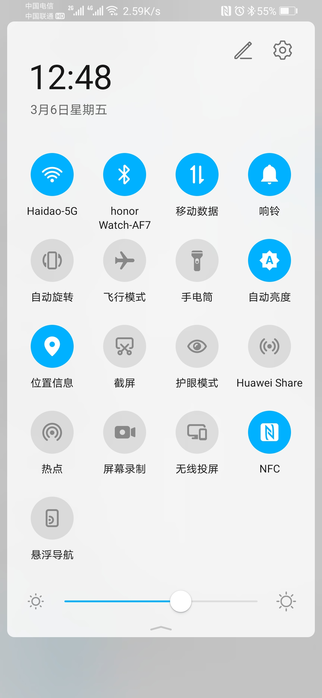
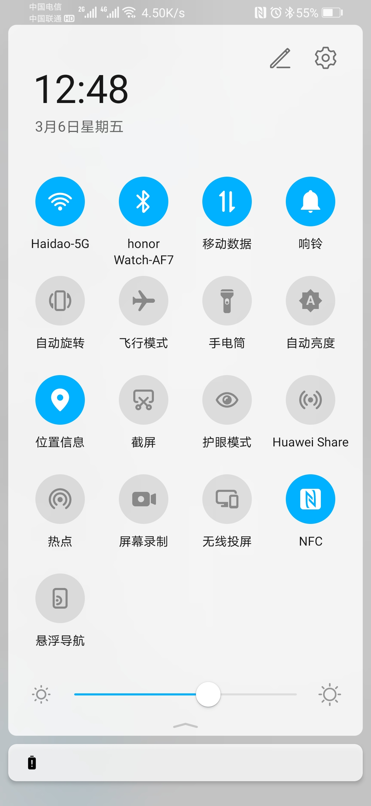

# 自动亮度调节助手
### 声明
1. 本应用是为了在下拉菜单中增加一个`自动亮度调节`的按钮,方便游戏时手动调节了亮度，退出游戏后又需要前往设置重新关闭打开自动亮度调节，化繁为简，简化操作而已。
2. 本应用切换亮度调节模式的功能需要`允许修改系统设置`，不联网，就是一个简单的本地应用，可放心使用。
### 题外话
1.magicUI3.0.0之前,下拉菜单是有相关按钮的，magicUI3.0.0升级android10之后没有了。